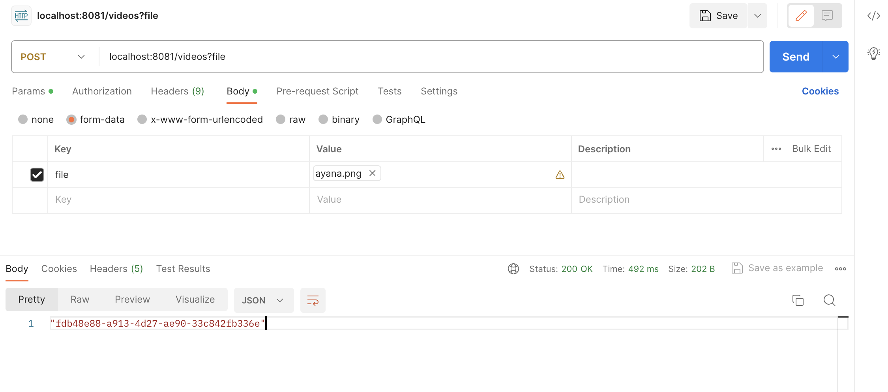
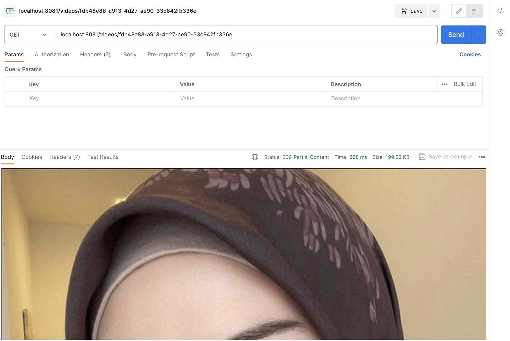

# spring-boot-minio

1. Introduction

   MinIO is a high-performance object storage system. It is designed to be an alternative to cloud-native storage
   systems.
   In fact, its API is fully compatible with Amazon S3.

   In this tutorial, we’ll get a quick introduction to working with MinIO.

2. About MinIO
   MinIO was designed from the beginning to be a fully compatible alternative to Amazon’s S3 storage API.
   They claim to be the most compatible S3 alternative while also providing comparable performance and scalability.

   MinIO also provides a variety of deployment options. It can run as a native application on most popular architectures
   and can also be deployed as a containerized application using Docker or Kubernetes.

Additionally, MinIO is open-source software. Organizations are free to use it under the terms of the AGPLv3 license.
Just beware that this option comes with no support aside from online documentation and the MinIO user community.
For larger enterprises, paid subscriptions with dedicated support are also available.

Because of its S3 API compatibility, ability to run in a variety of deployments, and open-source nature,
MinIO is a great tool for development and testing, as well as DevOps scenarios.

The MinIO Console
Another way to manage data in a MinIO deployment is with the web-based admin console. With the containerized deployment,
we start by opening the address http://127.0.0.1:9001 in a web browser. We log in using the default credentials of
minioadmin / minioadmin.

From there, we can create our first bucket:

### Things todo list

1. Clone this repository: `git clone https://github.com/hendisantika/spring-boot-minio.git`
2. Navigate to the folder: `cd spring-boot-minio`
3. Change your DB Credentials in `application.yml`
4. Setup your MinIO credentials in `application.yml`
5. Run your application: `mvn clean spring-boot:run`
6. Open your POSTMAN App

### Image Screen shot

Add New File

Get File

